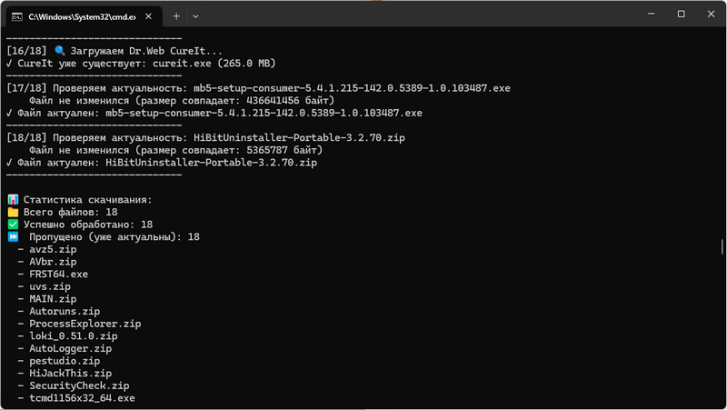

# tool_downloader 1.0

**Загрузчик антивирусных сканеров и других программ с возможностью создания общего ZIP-арива на выходе**

Программа для автоматического скачивания антивирусных утилит и диагностических инструментов с проверкой актуальности и упаковкой в ZIP-архив (при необходимости).



---

## Основные возможности

- Умная загрузка - скачивает только изменившиеся файлы (проверка по размеру)
- Поддержка Dr.Web CureIt - специальная логика для скачивания с официального сайта
- Чтение ссылок из файла с поддержкой комментариев
- Создание ZIP-архивов с настраиваемым именем
- Подробная статистика - точный отчет о выполнении


---

## Как настроить и пользоваться

В файл `links_info.txt` пропишите прямые ссылки на программы для загрузки. Рекомендую сначала изучить дефолтовый `links_info.txt` из релиза, и удалить из него ненужные ссылки на утилиты и прописать другие необходимые. 

После запуска `tool_downloader.exe` произойдет загрузка файлов в папку `downloads`. 

---

## Подготовка к работе
1. Создание файла со ссылками
Создайте файл `links_info.txt` в той же папке, где находится программа:

```cmd
# Антивирусные сканеры
https://free.drweb.ru/download+cureit+free/
http://devbuilds.kaspersky-labs.com/devbuilds/KVRT/latest/full/KVRT.exe
https://dl.comss.org/download/avz5.zip

# Системные утилиты  
https://download.sysinternals.com/files/Autoruns.zip
https://download.sysinternals.com/files/ProcessExplorer.zip

# Дополнительные инструменты
https://github.com/Neo23x0/Loki/releases/download/v0.51.0/loki_0.51.0.zip
https://www.bleepingcomputer.com/download/rkill/dl/10/
```

2. Формат файла ссылок
- Одна ссылка на строку
- Пустые строки игнорируются
- Строки с # или // в начале - комментарии
- Комментарии в конце строки через # или // также поддерживаются


---

## Использование

Базовый запуск (скачать все файлы):

`tool_downloader.exe`

Создать ZIP-архив после загрузки:

`tool_downloader.exe --zip my_tools.zip`

Если в текущей папке есть файл `readme.txt`, то он будет добавлен в архив.

Принудительно перезагрузить все файлы:

`tool_downloader.exe --force --zip updated_tools.zip`

Автоматический режим (без подтверждений):

`tool_downloader.exe --yes --zip antivirus_collection.zip`

Сохранить скачанные файлы (не удалять после архивации):

`tool_downloader.exe --zip archive.zip --keep`

Использовать другой файл со ссылками:

`tool_downloader.exe --links my_links.txt --zip tools.zip`

Указать другую папку для загрузки:

`tool_downloader.exe --output my_downloads --zip result.zip`


## Параметры командной строки

| Параметр     |	Сокращение |	Описание                                           |
|--------------|---------------|-------------------------------------------------------|
| --links FILE |		       | Файл со списком ссылок (по умолчанию: links_info.txt) |
| --output DIR |		       | Папка для скачивания (по умолчанию: downloads)        |
| --zip NAME   | 	           | Создать ZIP-архив с указанным именем                  |
| --keep       |		       | Не удалять скачанные файлы после архивации            |
| --no-readme  |		       | Не добавлять readme.txt в архив                       |
| --yes        |	-y	       | Автоматически подтверждать все запросы                |
| --force      |	-f	       | Принудительно перезагрузить все файлы                 |

При использовании в Заданиях Windows обязательно указать Рабочую папку.


## Связь

О выявленных ошибках и предложения пишите:
- Telegram: https://t.me/avhelpnew
- artemsoft[@]yahoo.com
